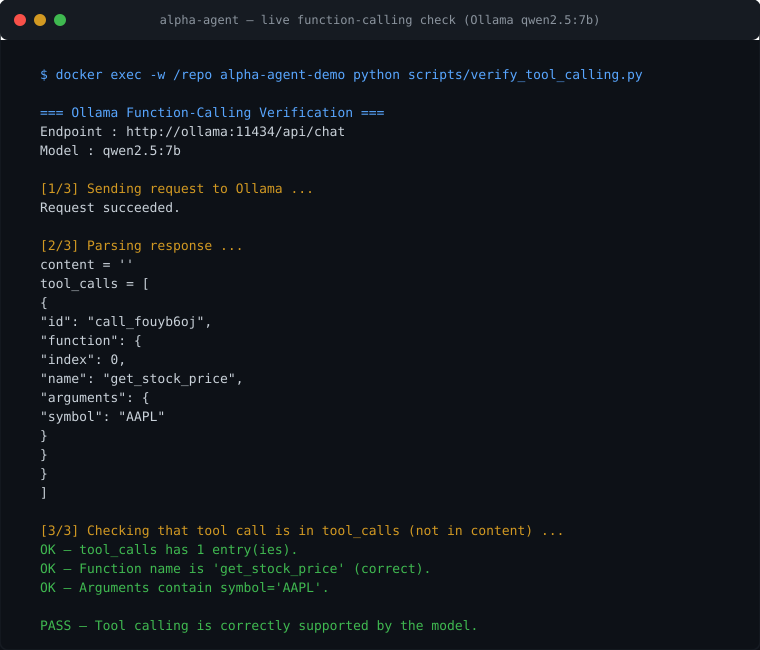

# AlphaAgent — Investment Research Agent with Tool Use & Guardrails

[](https://github.com/eLSeR17/alpha-agent/actions/workflows/ci.yml)
[](LICENSE)

> **What it demonstrates**: a real agentic system with LLM tool-use (function calling),
> safety guardrails, and grounding against hallucination — built entirely on local
> models (Ollama, no cloud, no API keys), now with a **production HTTP API** that
> supports local (Ollama) and cloud (OpenAI-compatible) backends plus response caching.

## Demo

Real function calling verified end-to-end against a local LLM (Ollama,
`qwen2.5:7b`) — the model returns a structured `tool_calls` payload that the
agent executes and guards:



Reproduce it with the demo container on the `docker_default` network:

```bash
docker exec -w /repo alpha-agent-demo python scripts/verify_tool_calling.py
```

## Problem

Financial research is time-consuming and error-prone. Analysts must manually gather
data from multiple sources, apply risk calculations, and synthesize news — all while
guarding against AI hallucination and prompt injection. Existing agent frameworks often
lack proper tool-use isolation, making them unsuitable for regulated domains like finance.

## Solution

AlphaAgent is a **ReAct agent** with real function calling that autonomously reasons
about investment queries, selects the appropriate financial tool, and generates
grounded answers. It includes multi-layer guardrails for input validation, tool
rate-limiting, and anti-hallucination anchoring — all running locally on a single
machine with zero cloud dependencies.

## HTTP API Server

AlphaAgent now ships as a **service**, not just a library. Run the FastAPI server
and integrate it from any client (web, Slack bot, mobile, other services).

### Quick start (Ollama backend — free, local)

```bash
pip install -r requirements.txt
uvicorn app:app --host 0.0.0.0 --port 8000
```

### Quick start (OpenAI backend — cloud)

```bash
export ALPHA_AGENT_BACKEND=openai
export OPENAI_API_KEY=sk-...
uvicorn app:app --host 0.0.0.0 --port 8000
```

### Docker

```bash
docker build -f Dockerfile.api -t alpha-agent-api .
# Ollama backend (runs on the docker_default network to reach Ollama)
docker run --rm -p 8000:8000 --network docker_default alpha-agent-api
# OpenAI backend
docker run --rm -p 8000:8000 -e ALPHA_AGENT_BACKEND=openai -e OPENAI_API_KEY=sk-... alpha-agent-api
```

### Endpoints

| Method | Path | Description |
|--------|------|-------------|
| `POST` | `/ask` | Ask a financial question. Returns the grounded answer + tool calls. |
| `GET` | `/health` | Liveness probe; reports backend and model in use. |
| `GET` | `/tools` | Lists the agent's tools (name, description, parameters). |

### Example

```bash
curl -X POST http://localhost:8000/ask \
  -H "Content-Type: application/json" \
  -d '{"question": "What is the current price of AAPL?"}'
```

```json
{
  "answer": "AAPL is trading at 319.97 USD (day change +1.2%).",
  "grounded": true,
  "blocked": false,
  "block_reason": null,
  "tool_calls": [
    {
      "tool_call": {"name": "get_stock_price", "arguments": {"symbol": "AAPL"}},
      "output": "{\"symbol\": \"AAPL\", \"price\": 319.97}",
      "success": true,
      "error": null
    }
  ],
  "iterations_used": 2,
  "from_cache": false
}
```

### Configuration (all env-driven)

| Variable | Default | Meaning |
|----------|---------|---------|
| `ALPHA_AGENT_BACKEND` | `ollama` | `ollama` (local) or `openai` (cloud/compatible) |
| `OLLAMA_BASE_URL` | `http://ollama:11434` | Ollama endpoint (Docker network) |
| `OLLAMA_MODEL` | `qwen2.5:7b` | Local model tag |
| `OPENAI_API_KEY` | — | Required when backend is `openai` |
| `AI_MODEL` | `gpt-4o-mini` | Model for OpenAI-compatible backend |
| `AI_BASE_URL` | — | Override for Groq / Azure / vLLM etc. |
| `MAX_ITERATIONS` | `5` | ReAct loop budget |
| `ALPHA_AGENT_CACHE` | `0` | `1` to enable SQLite response caching |
| `ALPHA_AGENT_CACHE_PATH` | `cache.sqlite3` | Cache DB file |
| `ALPHA_AGENT_CACHE_TTL` | `3600` | Cache validity in seconds |
| `LOG_LEVEL` | `INFO` | Logging verbosity |

### Query caching

Repeated identical questions are served from a SQLite store (keyed by SHA-256 of
the query) for `ALPHA_AGENT_CACHE_TTL` seconds — saving latency and tokens on paid
backends. Responses include `"from_cache": true` on cache hits.

## Features (Phase 1)

- **Agent core**: ReAct loop with configurable max iterations (thought → tool decision → execution)
- **Financial tools**: Market data · risk metrics · news · company fundamentals (via yfinance, free)
- **Guardrails**: Prompt-injection detection, financial disclaimer, tool rate-limiting,
  ticker validation, anti-hallucination grounding (numbers anchored to real tool data)
- **HTTP API**: FastAPI server with `/ask`, `/health`, `/tools` (Ollama or OpenAI backends)
- **Response caching**: SQLite-backed, TTL-configurable (optional)
- **209 unit tests**: Agent core, tools, guardrails, evals, API, cache, OpenAI client
- **E2E validation**: Real Ollama function calling verified end-to-end

## Architecture

```
┌─────────────────────────────────────────────────────────────┐
│                      User Query                             │
└─────────────────────┬───────────────────────────────────────┘
                      │
          ┌───────────▼───────────┐
          │  FinancialGuardrail   │  (injection detection, disclaimer)
          └───────────┬───────────┘
                      │
          ┌───────────▼───────────┐
          │    ToolGuardrail      │  (rate limiting, ticker validation)
          └───────────┬───────────┘
                      │
          ┌───────────▼───────────┐
          │    AlphaAgent (ReAct) │  (thought → decision → action loop)
          └───────────┬───────────┘
                      │
          ┌───────────▼───────────┐
          │    Financial Tools    │  (yfinance: market, risk, news, fundamentals)
          └───────────┬───────────┘
                      │
          ┌───────────▼───────────┐
          │  AntiHallucination    │  (grounding numbers to real tool output)
          └───────────┬───────────┘
                      │
          ┌───────────▼───────────┐
          │    Final Answer       │  (with citations and risk disclaimer)
          └───────────────────────┘
```

```
Client ──► HTTP API (FastAPI) ──► GuardedAlphaAgent
                                    ├─ AlphaAgent (ReAct loop)
                                    │    ├─ OllamaClient      (local, free)
                                    │    └─ OpenAIClient      (cloud, optional)
                                    ├─ Financial tools (yfinance)
                                    └─ Guardrails (input / output / grounding)
                                    └─ ResponseCache (SQLite, optional)
```

## Backend swap: Ollama ↔ OpenAI

The agent talks to a small LLM interface (`chat_with_tools()`). Two implementations
ship: `OllamaClient` (local, free, private) and `OpenAIClient` (any
OpenAI-compatible API). Swap with one environment variable:

```bash
export ALPHA_AGENT_BACKEND=openai      # default is ollama
```

The core agent code, tools, and guardrails are identical in both modes — the public
repo stays cloud-free by default, and the OpenAI backend is an opt-in for users who
want stronger models or lower latency.

## Stack

- **Python 3.11+** — type-hinted, clean, no threads
- **Ollama** (`qwen2.5:7b`, local) — function calling via chat completions API
- **OpenAI API** (optional) — `gpt-4o-mini` and other compatible models
- **FastAPI + uvicorn** — HTTP API server
- **yfinance** — free financial data (market prices, ratios, news)
- **SQLite** — optional response cache
- **Docker Compose** — `docker_default` network (same pattern as other projects)
- **pytest** — 209 unit tests + E2E validation

## Getting Started

### Prerequisites
- Ollama running locally with `qwen2.5:7b` pulled (`ollama pull qwen2.5:7b`)
  — or an OpenAI API key for the cloud backend
- Python 3.11+ with pip
- (Optional) Docker for containerized execution

### Run tests
```bash
cd alpha-agent
pip install -r requirements.txt
pytest tests/ -v
```

### Run the agent (E2E with real Ollama)

The package uses a `src/` layout, so point `PYTHONPATH` at `src/` and run a small
script that wires the agent with its real financial tools:

```bash
cd alpha-agent
PYTHONPATH=src python - <<'PY'
from alpha_agent import AlphaAgent, GuardedAlphaAgent, OllamaClient
from alpha_agent.tools import TOOL_REGISTRY

llm = OllamaClient()  # connects to local Ollama (qwen2.5:7b)
agent = GuardedAlphaAgent(
    AlphaAgent(llm_client=llm, tools=list(TOOL_REGISTRY.values()))
)
response = agent.analyze("What is the current stock price of AAPL?")
print(response.final_answer)
PY
```

### Run the API server (Ollama backend)
```bash
cd alpha-agent
PYTHONPATH=src uvicorn app:app --host 0.0.0.0 --port 8000
# open http://localhost:8000/docs for the interactive Swagger UI
```

## Tests

**209 unit tests** covering:
- Agent core (ReAct loop, tool selection, iteration limits)
- Financial tools (yfinance wrappers, error handling, rate limiting)
- Guardrails (injection detection, disclaimer enforcement, grounding)
- **Eval harness**: Golden dataset + LLM-as-judge + runner (regression testing)
- **HTTP API**: `/ask`, `/health`, `/tools` endpoints (with a scripted fake agent)
- **Response cache**: SQLite hit/miss, TTL expiry, round-trip fidelity
- **OpenAI client**: schema conversion, tool-call parsing, malformed-argument tolerance

E2E test validates real function calling with Ollama `qwen2.5:7b` — no mocks.

## CI

The project runs **GitHub Actions CI** on every push and pull request to `main`.
The pipeline tests against **Python 3.11 and 3.12** on `ubuntu-latest`.

All tests are fully deterministic (mocked LLM, mocked yfinance, scripted API agent) —
CI requires no external services, no Ollama, no OpenAI, and no network access.

## Development process

The full build is documented end-to-end in
[**`docs/DEVELOPMENT_LOG.md`**](docs/DEVELOPMENT_LOG.md): the phase-by-phase
timeline, and six real incident reports (what failed, when, why, how it was fixed,
and how the fix was verified) — from grounding false negatives to a
mis-calibrated LLM-as-judge. It is written to show *how* the agent was made
reliable, not just that it passed: every problem was reproduced against a real
local model, fixed with regression coverage, and re-validated end-to-end
(final real eval run: **mean 0.991 / 9 of 10 cases**).

## Roadmap

- ✅ **HTTP API server** (FastAPI, Ollama + OpenAI backends, caching)
- ✅ **Persistence/Memory**: SQLite response cache (repeated queries, instant answers)
- **Live demo**: Live demo + CI pipeline for automated quality checks
- **Evals (shipped)**: Golden dataset + LLM-as-judge + runner
  (see `scripts/run_evals.py` and `tests/test_evals.py`)
- **Conversation memory**: multi-turn context window management
- **Auth**: API key authentication for the HTTP server

## Limitations

- **Not investment advice**: This is a portfolio demonstration, not financial guidance.
  Always consult a qualified professional before making investment decisions.
- **Local model latency**: Ollama `qwen2.5:7b` on CPU adds 5-15s per inference.
  Production deployments would benefit from GPU acceleration or smaller models.
- **yfinance free tier**: Data is subject to rate limits and may lag real-time markets.
  No guarantee of data completeness or accuracy.
- **Educational scope**: Designed to demonstrate agentic patterns, not to replace
  commercial financial analysis tools.

## License

MIT — see [LICENSE](LICENSE). Free to use, modify and distribute with attribution.

---

**Disclaimer**: AlphaAgent is a portfolio project for educational purposes. It does
not provide financial advice, recommendations, or endorsements. All data is for
demonstration only. Past performance does not guarantee future results.

## Related portfolio projects

`alpha-agent` is externally evaluated by
[`evalforge`](https://github.com/eLSeR17/evalforge), a sibling portfolio project
that QAs this agent and
[`smart-contract-rag`](https://github.com/eLSeR17/smart-contract-rag) as
black-box subjects (golden datasets, dual judge, regression guard).
