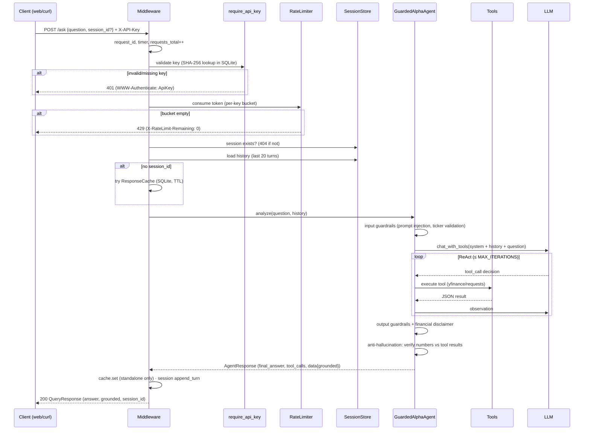

# AlphaAgent — Architecture

> How the pieces fit together, and what happens to a single request from
> arrival to answer. The code is deliberately split along two axes:
> **agent brain** (ReAct loop, tools, guardrails) and **service muscle**
> (API, auth, sessions, observability).

## Component map

```
┌──────────────────────────────  SERVICE MUSCLE  ──────────────────────────────┐
│  FastAPI app (api.py)                                                        │
│                                                                              │
│  Middleware: X-Request-ID · timing · /metrics counters · JSON request log    │
│  Dependencies: require_api_key (401) · check_rate_limit (429)                │
│  Stores: APIKeyStore (SQLite) · SessionStore (SQLite) · ResponseCache (SQLite)│
│  Entrypoints: POST /ask · POST /sessions · GET /health · GET /tools ·        │
│               GET /metrics · GET /  (web UI)                                 │
└──────────────────────────────┬───────────────────────────────────────────────┘
                               │ GuardedAlphaAgent
┌──────────────────────────────▼───────────────────  AGENT BRAIN  ─────────────┐
│  Guardrails (input)  →  AlphaAgent (ReAct)  →  Guardrails (output) + Anti-   │
│  hallucination grounding (numbers cross-checked against tool results)        │
│                                                                              │
│  Tools (TOOL_REGISTRY): get_stock_price · get_stock_history · get_company_   │
│  info · get_risk_metrics · get_news (yfinance / requests)                    │
│                                                                              │
│  LLM: OllamaClient | OpenAIClient (same chat_with_tools() contract — one     │
│  env var swaps the backend)                                                  │
└──────────────────────────────────────────────────────────────────────────────┘
```

## Request lifecycle (POST /ask with auth + session)



## Key design decisions (and why)

1. **Guardrails run on every turn.** `GuardedAlphaAgent.analyze(query,
   history)` threads conversation history *through* the guardrail layer —
   multi-turn chat is not a backdoor around input/output validation or
   grounding (this was a deliberate fix; see DEVELOPMENT_LOG Phase 5).
2. **Backend swap is one env var.** The agent only knows
   `chat_with_tools()`. `OllamaClient` and `OpenAIClient` implement the same
   contract, so confidence in one transfers to the other. Cloud stays an
   opt-in (`ALPHA_AGENT_BACKEND=openai` + key), local is the default.
3. **Auth stores hashes, not keys.** `APIKeyStore.create_key()` returns the
   plaintext exactly once; only SHA-256 digests persist. Revocation is a
   flag flip; validation is a constant-time compare against the digest.
4. **Rate limiting is per key, configurable per key.** `rate_limit_for()`
   reads the key's own budget from the DB; buckets refill at `limit/60` per
   second. Stored limit changes recreate the bucket immediately.
5. **Cache only serves context-free answers.** Multi-turn responses are
   excluded by design — the same question means different things in
   different conversations.
6. **503 is not 500.** A backend outage is a distinct, recoverable
   condition; the error tells the operator *which* env var to check.
7. **Tests are hermetic.** The 241-test suite needs no network and no LLM:
   `unittest.mock` fakes implement the same contracts (`llm`, `tools`,
   `analyze`). The eval harness (`scripts/run_evals.py`) is the *separate*
   live layer that talks to real Ollama.

## Failure modes (and how they surface)

| Failure | Surface | Notes |
|---------|---------|-------|
| LLM backend down | `503` with self-diagnosing message | wrapped httpx/ConnectionError |
| Invalid/missing key | `401` | middleware dependency |
| Rate limit exceeded | `429` + `X-RateLimit-Remaining: 0` | never retries silently |
| Unknown session | `404` | explicit, not silent new context |
| Empty/blank question | `422` | Pydantic + explicit check |
| Fabricated number | prepended "could not be verified" warning + `grounded: false` | AntiHallucinationGuardrail |
| Tool failure (provider 429/timeout) | tool returns `{"error": ...}`; agent adapts | tools catch-and-describe (BLE001 with justification) |
